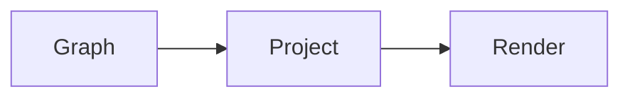

# Fixture plan — implementation plan

> plan p-20260905-fixture · revision r0007 · projection reviewer/implementation · compiler 1 · graph sha256:7a707cd4c2cb9b2380251bcec87d84ce1db4457f74dd6d1d68158b70f9b742b4 · projection sha256:8198062760f72371dad7e4c52ba732fa5a38b73a32dfa995659fdd30d857b9c9

## Goals

### goal-1 · Ship a typed plan graph
meta: {"attrs":{},"body_chars":33,"body_state":"full","created_rev":"r0001","ext":null,"geometry":null,"kind":"goal","order":1000,"stage":"implementation","updated_rev":"r0001"}
relationships-json: []

The graph is the source of truth.

## Constraints and invariants

### inv-1 · No sealed leakage
meta: {"attrs":{},"body_chars":40,"body_state":"full","created_rev":"r0002","ext":null,"geometry":null,"kind":"invariant","order":3000,"stage":"implementation","updated_rev":"r0002"}
relationships-json: []

Unreadable partitions are never decoded.

## Tasks

### task-1 · Build the graph core
meta: {"attrs":{"status":"active"},"body_chars":0,"body_state":"elided","created_rev":"r0003","ext":null,"geometry":{"h":160,"w":320,"x":40,"y":80,"z":1},"kind":"task","order":4000,"stage":"implementation","updated_rev":"r0005"}
relationships-json: []


### task-2 · Compile projections
meta: {"attrs":{"status":"active"},"body_chars":0,"body_state":"elided","created_rev":"r0004","ext":null,"geometry":{"h":160,"w":320,"x":440,"y":80,"z":2},"kind":"task","order":5000,"stage":"implementation","updated_rev":"r0007"}
depends on: task-1
relationships-json: [{"attrs":{},"created_rev":"r0004","ext":{"dev.grogu.review":{"weight":3}},"from":"task-2","id":"edge-1","kind":"depends_on","to":"task-1"}]


## Diagrams

### dia-1 · Compiler flow
meta: {"attrs":{"parsed":{"edges":[],"lines":3,"nodes":[],"partial":false,"subgraphs":[],"supported":true,"type":"flowchart","unparsed":0},"source":"flowchart LR\n  Graph --> Project\n  Project --> Render\n"},"body_chars":54,"body_state":"full","created_rev":"r0005","ext":null,"geometry":{"h":260,"w":720,"x":40,"y":320,"z":1},"kind":"diagram","order":9000,"stage":"implementation","updated_rev":"r0005"}
relationships-json: []



## Validation criteria

### crit-1 · Compiler round-trips
meta: {"attrs":{},"body_chars":23,"body_state":"full","created_rev":"r0004","ext":null,"geometry":null,"kind":"criterion","order":6000,"stage":"implementation","updated_rev":"r0004"}
validates: task-1
relationships-json: [{"attrs":{},"created_rev":"r0004","from":"crit-1","id":"edge-2","kind":"validates","to":"task-1"}]

parse(render(IR)) == IR

## Risks

### risk-1 · Importer loses prose
meta: {"attrs":{"mitigation":"preserve source spans"},"body_chars":40,"body_state":"full","created_rev":"r0004","ext":null,"geometry":null,"kind":"risk","order":7000,"stage":"implementation","updated_rev":"r0004"}
relationships-json: []

Unknown sections must become note nodes.

## Discussion

### reg-1 · Compiler
meta: {"attrs":{},"body_chars":0,"body_state":"full","created_rev":"r0005","ext":null,"geometry":{"h":340,"w":800,"x":0,"y":280,"z":0},"kind":"region","order":10000,"stage":"implementation","updated_rev":"r0005"}
contains: dia-1
relationships-json: [{"attrs":{},"created_rev":"r0005","from":"reg-1","id":"edge-3","kind":"contains","to":"dia-1"}]


## Comment threads

### thr-1 · Clarify the task body
meta: {"attrs":{"anchor_state":"resolved","comments":[{"at":"2026-09-05T20:00:00Z","author":"reviewer","body":"Should this mention the cache key?","id":"c1","revision":"r0006","role":"reviewer"}],"selector":{"id":"task-2","type":"node"},"status":"open"},"body_chars":34,"body_state":"full","created_rev":"r0006","ext":null,"geometry":null,"kind":"thread","order":11000,"stage":"implementation","updated_rev":"r0006"}
anchors: task-2
relationships-json: [{"attrs":{},"created_rev":"r0006","from":"thr-1","id":"edge-4","kind":"anchors","to":"task-2"}]

Should this mention the cache key?

## Extensions

### edge-1 · Extensions
```json
{"element":"edge","ext":{"dev.grogu.review":{"weight":3}},"id":"edge-1"}
```

## Elided

- 1 note item(s), body: note-1
- 1 note item(s), node: note-1
- 2 task item(s), distant task body: task-1, task-2
elided-json: [{"detail":"body","id":"note-1","kind":"note"},{"detail":"node","id":"note-1","kind":"note"},{"detail":"distant task body","id":"task-1","kind":"task"},{"detail":"distant task body","id":"task-2","kind":"task"}]

## Provenance

- source revision r0007, written 2026-09-05T20:05:00Z by architect@plan-v2-architect
- graph digest sha256:7a707cd4c2cb9b2380251bcec87d84ce1db4457f74dd6d1d68158b70f9b742b4
- projection digest sha256:8198062760f72371dad7e4c52ba732fa5a38b73a32dfa995659fdd30d857b9c9
- compiler grogu-plan-compile/1
- budget 2400 characters (exceeded)
provenance-json: {"budget_chars":2400,"budget_exceeded":true,"canvas":{"snap":8,"viewport":{"x":0,"y":0,"zoom_milli":1000}},"compiler":1,"depth":null,"graph_digest":"sha256:7a707cd4c2cb9b2380251bcec87d84ce1db4457f74dd6d1d68158b70f9b742b4","include":"all","plan_id":"p-20260905-fixture","projection_id":"sha256:62024d743281842863f20d8d3d9ffaaeaa6a41fdbbdc070b7225dd0ecd4076a9","revision":"r0007","role":"reviewer","sealed_relationships":0,"since":"","source_actor":"architect","source_agent":"plan-v2-architect","source_at":"2026-09-05T20:05:00Z","source_provenance":{"actor":"architect","agent":"plan-v2-architect","at":"2026-09-05T20:05:00Z","role":"architect"},"source_role":"architect","stages":["implementation"]}
