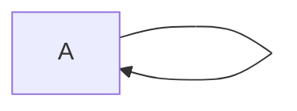

# Diagram self-loop — implementation plan

> plan p-golden-loop · revision r0001 · projection reviewer/implementation · compiler 1 · graph sha256:fe035bf50dddec223d5e4901b2c7adbcc04efd80840fa5e653acf8a9149dac95 · projection sha256:18b73c42a470a275a6827d239088881bbcafa545ac833ebfde141df21ecc26b2

## Diagrams

### dia-1 · Loop
meta: {"attrs":{"source":"flowchart LR\n  A --> A\n"},"body_chars":23,"body_state":"full","created_rev":"r0001","ext":null,"geometry":null,"kind":"diagram","order":1000,"stage":"implementation","updated_rev":"r0001"}
contains: note-1
relationships-json: [{"attrs":{},"created_rev":"r0001","from":"dia-1","id":"edge-1","kind":"contains","to":"note-1"}]

## Discussion

### note-1 · A
meta: {"attrs":{"mermaid_id":"A","source":"mermaid"},"body_chars":0,"body_state":"full","created_rev":"r0001","ext":null,"geometry":null,"kind":"note","order":2000,"stage":"implementation","updated_rev":"r0001"}
diagram edge: note-1
relationships-json: [{"attrs":{"edge_index":0,"label":"","operator":"-->","pair_ordinal":0},"created_rev":"r0001","from":"note-1","id":"edge-2","kind":"diagram_edge","to":"note-1"}]

## Provenance

- source revision r0001, written unknown by unknown
- graph digest sha256:fe035bf50dddec223d5e4901b2c7adbcc04efd80840fa5e653acf8a9149dac95
- projection digest sha256:18b73c42a470a275a6827d239088881bbcafa545ac833ebfde141df21ecc26b2
- compiler grogu-plan-compile/1
provenance-json: {"budget_chars":null,"budget_exceeded":false,"canvas":{"snap":8},"compiler":1,"depth":null,"graph_digest":"sha256:fe035bf50dddec223d5e4901b2c7adbcc04efd80840fa5e653acf8a9149dac95","include":"all","plan_id":"p-golden-loop","projection_id":"sha256:cf9a3e58d745117fb5d23f8f83c4486be96cc89908eef0e6e92e62358de43dfc","revision":"r0001","role":"reviewer","sealed_relationships":0,"since":"","source_actor":"","source_agent":"","source_at":"","source_provenance":{},"source_role":"","stages":["implementation"]}
