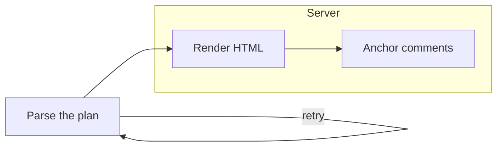

# What this is — implementation plan

> plan p-golden-migrated · revision r0001 · projection reviewer/implementation · compiler 1 · graph sha256:ea885ac0bc04d90fd3e0094f8fb8d97d38c28374275aa20d2b54a874cd3299f0 · projection sha256:51b49c38ec2deca0a66e5308d0da9c6e5497f506c7a15900e2a218a954b8e997

## Diagrams

### dia-1 · Mermaid diagram 1
meta: {"attrs":{"parsed":{"edges":[{"edge_index":0,"from":"Parse","kind":"arrow","label":"","line":2,"operator":"-->","pair_ordinal":0,"to":"Render"},{"edge_index":1,"from":"Render","kind":"arrow","label":"","line":3,"operator":"-->","pair_ordinal":0,"to":"Anchor"},{"edge_index":2,"from":"Parse","kind":"arrow","label":"retry","line":4,"operator":"-->","pair_ordinal":0,"to":"Parse"}],"lines":8,"nodes":[{"id":"Parse","label":"Parse the plan","line":2,"shape":"rectangle","subgraph":""},{"id":"Render","label":"Render HTML","line":2,"shape":"rectangle","subgraph":""},{"id":"Anchor","label":"Anchor comments","line":3,"shape":"rectangle","subgraph":""}],"partial":false,"subgraphs":[{"id":"Server","line":5,"title":"Server"}],"supported":true,"type":"flowchart","unparsed":0},"source":"flowchart LR\n  Parse[Parse the plan] --> Render[Render HTML]\n  Render --> Anchor[Anchor comments]\n  Parse -->|retry| Parse\n  subgraph Server\n    Render\n    Anchor\n  end\n","source_end":503,"source_start":319},"body_chars":169,"body_state":"full","created_rev":"r0001","ext":null,"geometry":null,"kind":"diagram","order":5000,"stage":"implementation","updated_rev":"r0001"}
contains: note-5, note-6, note-7
relationships-json: [{"attrs":{},"created_rev":"r0001","from":"dia-1","id":"edge-2","kind":"contains","to":"note-5"},{"attrs":{},"created_rev":"r0001","from":"dia-1","id":"edge-3","kind":"contains","to":"note-6"},{"attrs":{},"created_rev":"r0001","from":"dia-1","id":"edge-4","kind":"contains","to":"note-7"}]

## Discussion

### note-1 · Overview
meta: {"attrs":{"source":"markdown-import","source_end":146,"source_start":15},"body_chars":131,"body_state":"full","created_rev":"r0001","ext":null,"geometry":null,"kind":"note","order":1000,"stage":"implementation","updated_rev":"r0001"}
relationships-json: []

A local, browser-based surface for reading a plan and **commenting on it**,
launched from the CLI with `grogu review <plan-id>`.

### note-2 · Invariants
meta: {"attrs":{"source":"markdown-import","source_end":302,"source_start":160},"body_chars":142,"body_state":"full","created_rev":"r0001","ext":null,"geometry":null,"kind":"note","order":2000,"stage":"implementation","updated_rev":"r0001"}
relationships-json: []

- **I1.** Markdown is *canonical*. The workspace never writes a stage body.
- **I2.** Every stage read goes through `PlanStore.read_stage`.

### note-3 · The pipeline
meta: {"attrs":{"source":"markdown-import","source_end":504,"source_start":318},"body_chars":186,"body_state":"full","created_rev":"r0001","ext":null,"geometry":null,"kind":"note","order":3000,"stage":"implementation","updated_rev":"r0001"}
contains: dia-1
relationships-json: [{"attrs":{},"created_rev":"r0001","from":"note-3","id":"edge-1","kind":"contains","to":"dia-1"}]

### note-4 · A table
meta: {"attrs":{"source":"markdown-import","source_end":842,"source_start":515},"body_chars":327,"body_state":"full","created_rev":"r0001","ext":null,"geometry":null,"kind":"note","order":4000,"stage":"implementation","updated_rev":"r0001"}
relationships-json: []

| Stage | Reader |
| --- | --- |
| design | everyone |
| testing | tester only |

Inline `code`, **strong**, *emphasis*, a [link](https://example.com), and an
autolink <https://grogu.example> all render. An image  becomes a
link chip, never an ``.

> A block quote, for good measure.

- one
- two
  - nested

### note-5 · Parse the plan
meta: {"attrs":{"diagram":"dia-1","mermaid_id":"Parse","shape":"rectangle","source":"mermaid"},"body_chars":0,"body_state":"full","created_rev":"r0001","ext":null,"geometry":null,"kind":"note","order":6000,"stage":"implementation","updated_rev":"r0001"}
diagram edge: note-5, note-6
relationships-json: [{"attrs":{"edge_index":2,"edge_kind":"arrow","label":"retry","operator":"-->","pair_ordinal":0,"source":"mermaid"},"created_rev":"r0001","from":"note-5","id":"edge-7","kind":"diagram_edge","to":"note-5"},{"attrs":{"edge_index":0,"edge_kind":"arrow","label":"","operator":"-->","pair_ordinal":0,"source":"mermaid"},"created_rev":"r0001","from":"note-5","id":"edge-5","kind":"diagram_edge","to":"note-6"}]

### note-6 · Render HTML
meta: {"attrs":{"diagram":"dia-1","mermaid_id":"Render","shape":"rectangle","source":"mermaid"},"body_chars":0,"body_state":"full","created_rev":"r0001","ext":null,"geometry":null,"kind":"note","order":7000,"stage":"implementation","updated_rev":"r0001"}
diagram edge: note-7
relationships-json: [{"attrs":{"edge_index":1,"edge_kind":"arrow","label":"","operator":"-->","pair_ordinal":0,"source":"mermaid"},"created_rev":"r0001","from":"note-6","id":"edge-6","kind":"diagram_edge","to":"note-7"}]

### note-7 · Anchor comments
meta: {"attrs":{"diagram":"dia-1","mermaid_id":"Anchor","shape":"rectangle","source":"mermaid"},"body_chars":0,"body_state":"full","created_rev":"r0001","ext":null,"geometry":null,"kind":"note","order":8000,"stage":"implementation","updated_rev":"r0001"}
relationships-json: []

## Provenance

- source revision r0001, written unknown by reviewer@migration
- graph digest sha256:ea885ac0bc04d90fd3e0094f8fb8d97d38c28374275aa20d2b54a874cd3299f0
- projection digest sha256:51b49c38ec2deca0a66e5308d0da9c6e5497f506c7a15900e2a218a954b8e997
- compiler grogu-plan-compile/1
provenance-json: {"budget_chars":null,"budget_exceeded":false,"canvas":{"snap":8},"compiler":1,"depth":null,"graph_digest":"sha256:ea885ac0bc04d90fd3e0094f8fb8d97d38c28374275aa20d2b54a874cd3299f0","include":"all","plan_id":"p-golden-migrated","projection_id":"sha256:cf9a3e58d745117fb5d23f8f83c4486be96cc89908eef0e6e92e62358de43dfc","revision":"r0001","role":"reviewer","sealed_relationships":0,"since":"","source_actor":"","source_agent":"migration","source_at":"","source_provenance":{"actor":"","agent":"migration","at":"","role":"reviewer"},"source_role":"reviewer","stages":["implementation"]}
