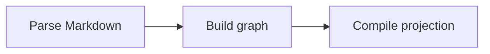

# Legacy implementation

Introductory prose that is not inside a level-two section.

## Invariants

- Markdown remains readable.
- Unknown prose is retained.

## Dependency map

## Unusual prose

This heading is not part of the compiler grammar.

### A nested heading

Its body remains byte-for-byte inside the imported note.
