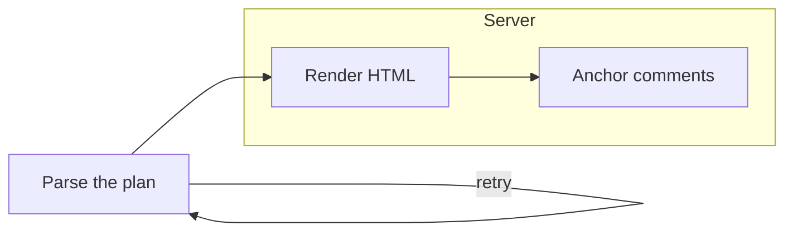

# What this is

A local, browser-based surface for reading a plan and **commenting on it**,
launched from the CLI with `grogu review <plan-id>`.

## Invariants

- **I1.** Markdown is *canonical*. The workspace never writes a stage body.
- **I2.** Every stage read goes through `PlanStore.read_stage`.

## The pipeline

## A table

| Stage | Reader |
| --- | --- |
| design | everyone |
| testing | tester only |

Inline `code`, **strong**, *emphasis*, a [link](https://example.com), and an
autolink <https://grogu.example> all render. An image  becomes a
link chip, never an ``.

> A block quote, for good measure.

- one
- two
  - nested
